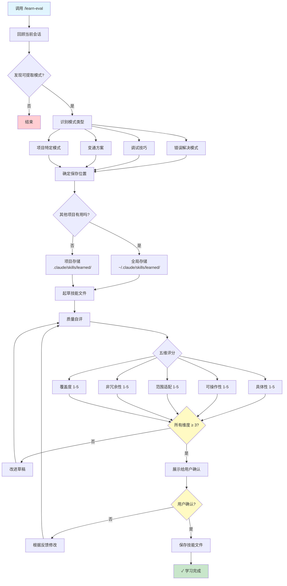

# Agent Continuous Learning

从 AI Agent 会话中自动提取、评估和保存可重用模式的系统。
参考：https://github.com/affaan-m/everything-claude-code/tree/main

## 概述

这个项目实现了一套 **持续学习机制**，让 AI Agent 能够：

1. **提取模式** — 从会话中识别有价值的问题解决模式、调试技巧和变通方案
2. **质量评估** — 使用五维评分表对提取的模式进行自评，确保质量
3. **智能存储** — 根据模式的适用范围，自动选择全局或项目级别的存储位置

## 核心功能

### 模式提取

系统会自动识别以下类型的可重用知识：

| 类型 | 描述 |
|------|------|
| 错误解决模式 | 根因分析 + 修复方案 + 可复用性评估 |
| 调试技巧 | 非显而易见的调试步骤、工具组合使用 |
| 变通方案 | 库的怪癖、API 限制、版本特定的修复方法 |
| 项目特定模式 | 约定、架构决策、集成模式 |

### 质量评估

使用五维评分表确保保存的技能质量：

| 维度 | 评估内容 |
|------|----------|
| 具体性 | 是否有充足的代码示例 |
| 可操作性 | 是否立即可执行 |
| 范围适配 | 名称、触发条件、内容是否匹配 |
| 非冗余性 | 是否提供独特的价值 |
| 覆盖度 | 是否覆盖主要场景和边界情况 |

每个维度 1-5 分，总分 25 分。所有维度必须 ≥ 3 分才能保存。

### 存储策略

- **全局存储** (`~/.claude/skills/learned/`)：可在多个项目中复用的通用模式
- **项目存储** (`.claude/skills/learned/`)：项目特定的知识和约定

## 文件结构

```
Agent-Continuous-Learning/
├── README.md           # 项目说明
├── learn-eval.md       # 核心技能定义：提取、评估、保存流程
└── .claude/
    └── skills/
        └── learned/    # 项目级学习到的技能
```

## 使用方法

在 Claude Code 中调用 `/learn-eval` 命令，系统会：

1. 回顾当前会话，寻找可提取的模式
2. 识别最有价值的洞察
3. 确定保存位置（全局 vs 项目）
4. 起草技能文件
5. 进行质量自评
6. 展示给用户确认
7. 保存到确定的位置

## 流程图



## 设计理念

- **不提取琐碎修复** — 拼写错误、简单语法错误不值得保存
- **不提取一次性问题** — 特定 API 宕机等临时问题不保存
- **聚焦可复用性** — 只保存能在未来会话中节省时间的模式
- **保持单一职责** — 一个模式对应一个技能文件

## License

MIT
